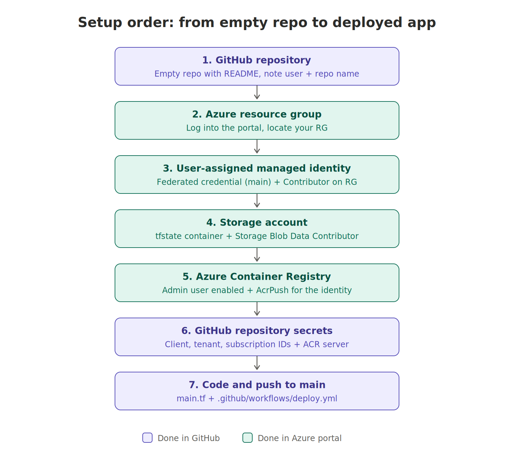
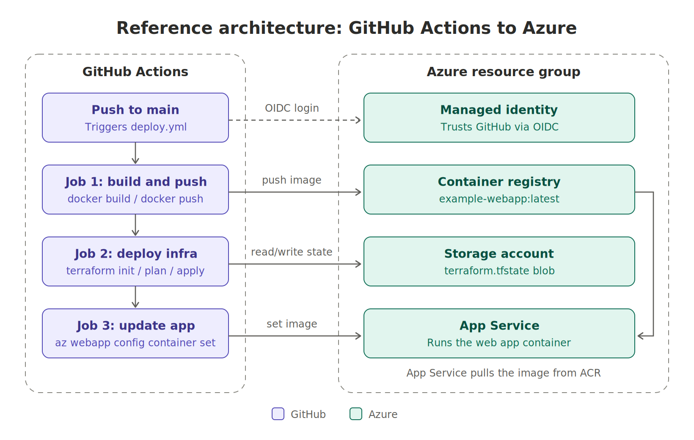
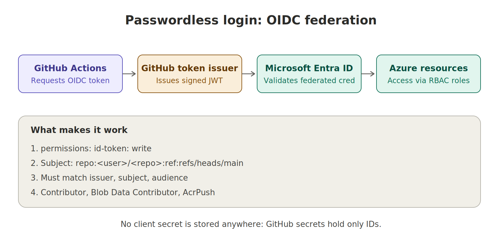
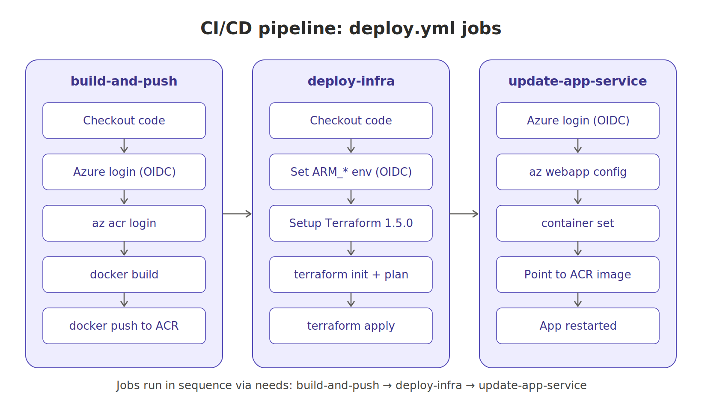

# Azure Global 2026 Kraków — Secure CI/CD to Azure

This repository contains my completed work from the **Global Azure 2026 Kraków** workshop (16.04.2026), led by Dominik Skowron, Damian Maczuga and Paweł Chylak. Forked from [donnik007/AzureGlobal2026Krakow](https://github.com/donnik007/AzureGlobal2026Krakow).

I built a fully automated CI/CD pipeline that containerizes a web application, provisions Azure infrastructure with Terraform, and deploys the app to Azure App Service. Every run authenticates to Azure **without a single stored password**, using OpenID Connect (OIDC) federation between GitHub and a Managed Identity.

## What I accomplished

- Set up a GitHub repository and connected it to an Azure resource group
- Created a **User-Assigned Managed Identity** with a federated credential trusting this repo's `main` branch
- Provisioned an **Azure Storage Account** as the remote backend for Terraform state
- Created an **Azure Container Registry (ACR)** to host the application image
- Applied least-privilege **RBAC role assignments** to the identity
- Stored only non-secret identifiers as **GitHub Actions secrets**
- Wrote the Terraform configuration (`main.tf`) and the GitHub Actions workflow (`.github/workflows/deploy.yml`)
- Deployed successfully: every push to `main` now builds, provisions and releases automatically

## Setup order

The resources were created in a specific order, because each step depends on the one before it. The managed identity has to exist before it can be granted roles on the storage account and registry, and all Azure IDs must exist before they can be saved as GitHub secrets.



| Step | Where | What | Why |
|------|-------|------|-----|
| 1 | GitHub | Repository | Hosts code and runs the workflow |
| 2 | Azure | Resource group | Container for all workshop resources |
| 3 | Azure | Managed identity + federated credential | The identity the pipeline logs in as |
| 4 | Azure | Storage account (`tfstate`) | Remote, shared Terraform state |
| 5 | Azure | Container registry | Stores the Docker image |
| 6 | GitHub | Repository secrets | Gives the workflow the IDs it needs |
| 7 | GitHub | `main.tf` + `deploy.yml` | Infrastructure and pipeline as code |

## Reference architecture



A push to `main` triggers the workflow. The workflow logs in as the managed identity, pushes the image to ACR, runs Terraform (keeping its state in blob storage), and finally points the App Service at the new image. The App Service then pulls that image from ACR and runs it.

## Passwordless authentication (OIDC)



Instead of storing a service principal secret, the workflow requests a short-lived token from GitHub (enabled by `permissions: id-token: write`). Microsoft Entra ID checks that the token's issuer, subject (`repo:<user>/<repo>:ref:refs/heads/main`) and audience match the federated credential on the managed identity. If they match, the workflow receives an Azure access token scoped to the roles below.

### Role assignments on the managed identity

| Scope | Role | Used for |
|-------|------|----------|
| Resource group | Contributor | Terraform creating and updating resources |
| Storage account | Storage Blob Data Contributor | Reading and writing `terraform.tfstate` |
| Container registry | AcrPush | Pushing the Docker image |

### GitHub secrets

| Secret | Source |
|--------|--------|
| `AZURE_CLIENT_ID` | Managed identity overview |
| `AZURE_TENANT_ID` | Managed identity → Settings → Properties |
| `AZURE_SUBSCRIPTION_ID` | Managed identity overview |
| `ACR_LOGIN_SERVER` | Container registry overview |

None of these are passwords. On their own they grant no access; access only works for a token issued to this repository's `main` branch.

## CI/CD pipeline



The workflow in `.github/workflows/deploy.yml` has three jobs chained with `needs:`, so each only starts after the previous one succeeds.

1. **build-and-push** — checks out the code, logs into Azure and ACR, builds the Docker image and pushes it as `example-webapp:latest`.
2. **deploy-infra** — sets the `ARM_*` environment variables with `ARM_USE_OIDC=true`, installs Terraform 1.5.0, then runs `terraform init`, `plan` and `apply -auto-approve` against the remote state backend.
3. **update-app-service** — logs into Azure and runs `az webapp config container set` to point the App Service at the latest image in ACR.

## Repository structure

```
.
├── .github/
│   └── workflows/
│       └── deploy.yml     # CI/CD pipeline
├── images/                # Illustrations used in this README
├── src/                   # Application source and Dockerfile
├── main.tf                # Terraform configuration and azurerm backend
├── variables.tf           # Terraform variables
└── README.md
```

## Terraform backend

State is stored remotely so that every pipeline run sees the same infrastructure:

```hcl
terraform {
  backend "azurerm" {
    resource_group_name  = "<your-resource-group>"
    storage_account_name = "<your-storage-account>"
    container_name       = "tfstate"
    key                  = "terraform.tfstate"
  }
}
```

## Key takeaways

- **No long-lived secrets.** OIDC federation removes the risk of leaked client secrets and the chore of rotating them.
- **Least privilege.** The identity only has the roles each job actually needs.
- **Infrastructure as Code.** The environment is reproducible from the repository; the Azure portal is only for verification and debugging.
- **Remote state.** Terraform state in blob storage keeps runs consistent and safe.
- **Ordered, gated deployment.** The image exists before infrastructure is applied, and infrastructure exists before the app is updated.

## Credits

Workshop materials by [Dominik Skowron](https://www.linkedin.com/in/dominikskowron007/), [Damian Maczuga](https://www.linkedin.com/in/damianmaczuga/) and [Paweł Chylak](https://www.linkedin.com/in/pawel-chylak/) for Global Azure 2026 Kraków. Terraform modules: [pchylak/global_azure_2026_ccoe](https://github.com/pchylak/global_azure_2026_ccoe).
